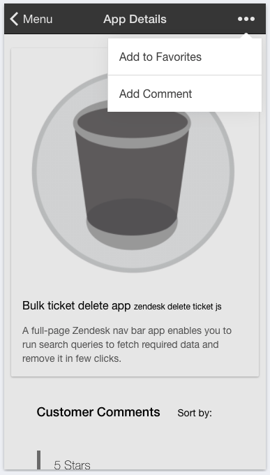

# GiveThatDevACookie

*THIS IS EDUCATIONAL PROJECT FROM COURSERA.COM*

Alternative app marketplace for cloud based ticketing systems like zendesk.com. Busy developers who are making great apps but has no time for marketing, branding and other laborious tasks can quickly advertise their apps.

Currently for submitting an app on official marketplace it requires quite a few steps:
 	Create an app itself
 	Answer branding requirements (icons, images, other branding assets)
 	Write all sort of descriptions
 	Create account with stripe.com
 	Submit an app and wait for approval

Not every busy developer will be happy going through all these steps. For some of them this can be a showstopper. Developers want to code – not do marketing. These obstacles may result in number of great ideas not seeing the world.

Alternative app marketplace will enable developers to advertise their apps by providing minimum information. This should encourage talented coders to build great apps and do not worry about all related activities.

Visitors of alternative app marketplace (ticketing system administrators or other developers) will have another great place where they can look for solutions they need.

Cloud based ticketing platforms such as zendesk.com may use alternative app marketplace to look for great apps or talented authors and help them developing their ideas. Alternative app marketplace is another community place for industry developers.

## About the app

This is Ionic driven hybrid mobile app for both iOS and Android platforms.

This app is derived from original Angular JS application hosted [here](https://github.com/Sarapulov/GiveThatDevACookie)

## How to run

1. `npm install`
2. `bower install`
3. You may need to install cordova and do some light configuration at this step. Refer to cordova/ionic documentation online
4. `ionic serve --lab`

[!] App uses https://givethatdevacookie.herokuapp.com service for REST API. If it is not available it requires to perform relevant modifications. One possible workaround is to download the REST server from [here](https://github.com/Sarapulov/GiveThatDevACookie) > run it > refer to this server in Ionic app. It will also require MongoDB instance.

[!] In order to run in browser you may face CORS related issues. To address this one you can install CORS extension from chrome and run it. It attach cross domain headers to each request making it CORS friendly.

## Demo

## Screenshots

